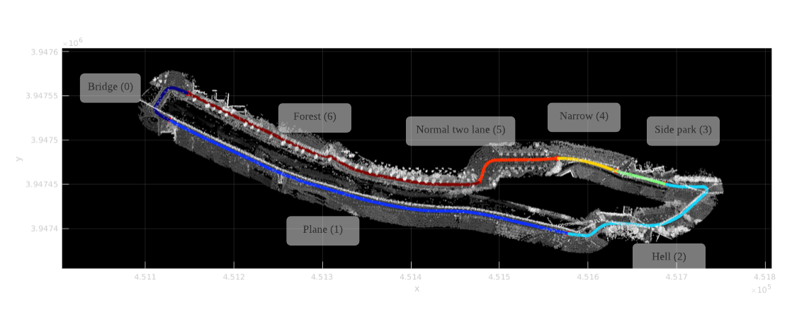

# atypical_driving_snu

<p align="center">
 
</p>



## Instruction
### 1. Getting started 
#### Dependencies
* driving_msgs: 
  ```
  git clone https://gitlab.com/InstitutMaupertuis/graph_rviz_plugin
  ```

* graph_rviz_plugin:
  ```
  https://gitlab.com/InstitutMaupertuis/graph_rviz_plugin
  ```

* misc
    ```
    sudo apt-get install ros-${ROS_DISTRO}-costmap-2d
    sudo apt-get install ros-${ROS_DISTRO}-pointcloud-to-laserscan
    sudo apt-get install ros-${ROS_DISTRO}-tf2-bullet 
    sudo apt-get install ros-${ROS_DISTRO}-jsk-visualization
    ```

* occupancy grid utils for 18.04

    ```
    https://github.com/clearpathrobotics/occupancy_grid_utils.git
    ```
* occupancy grid utils for 20.04

    ```
    https://github.com/LARR-Planning/occupancy_grid_utils.git
    ```

#### Test launch

1) Yugokri 
    ```
    roslaunch atypical_driving atypical_driving_snu_yugokri.launch 
    ```

2) Mapping HD map 

    ```
    roslaunch atypical_driving run_rtabmap_yugokri.launch 
    ```
    
    At the end of rosbag play, do rosbag a little bit.  
    ```
    cd /your/fucking/bag/dir
    rosrun pcl_ros pointcloud_to_pcd input:=/rtabmap/cloud_map
    ```
    Then press `ctrl + c`.
    
    If you cannot stand fucking visualization vibration due to the big transform from `map` to `SNU`, change them in rtabmap_ros node
    ```
        <arg name="odom_frame_id" value="SNU"/>
        <arg name="map_frame_id" value="SNU"/>
    ```
    
    Then run `world/yugokri/mapper.m`.
    
    * If you want to visualize hd map in rviz w.r.t SNU frame, set SNU frame for rtabmap, and launch the below after which push spacebar. 
    ```
        roslaunch atypical_driving see_yugokri.launch
    ```
3) Zoning
    We have to go to  `worlds/yugokri_hd` and run  `mapper.m`.   Where we will generate an integrated csv file where each row is = [x,y,w,sectionId] 


### 2. Roles

| Workforce      | Header           | Source  |
| ------------- |:-------------:| -----:|
| Boseong      | Wrapper.h | Wrapper.cpp |
| Jungwon      | Wrapper.h / GlobalPlanner.h      |  Wrapper.cpp / GlobalPlanner.cpp |
| Yunwoo | LocalPlanner.h      |    LocalPlanner.cpp |


### Parameter description 

### B

#### 1) lane-dependent 
* `use_keti_velocity` : Setting this to true will use the velocity of `detected_object` message as the constant velocity of a obstacle path. 
The velocity of the obstacle path is the average of the keti velocities. Using this, the target position is predicted. In case of the pose,
 use just fit using a linear regression of the raw data of keti observation. Setting this parameter to false will use linear regression for 
 all translation and orientation altogther while using coefficients of the fitting model for the representative speed (for dynamic object thresholding or visualization)
* `map/pcl_lx[ly]` : pointcloud process bound (+lx/2 -lx/2). This region is cropped for `velodyne_points_snu` . The reference frame is `velodyne`
* `map/pcl_z_min` : we first set the `pnt.z` < `pcl_z_min` as the candidates for the ground pointcloud. We run ransac to this points only 
* `map/pcl_dbscan_minpnts` : the minimum neighbors in the search radius for not to be removed as speckle
* `map/pcl_dbscan_eps`: the radius search bound for speckle removal
* `use_ransac` : whether to use ransac over original simple cropping  
* `map/ransac_post_inclusion_offset` : distance offset for including additional ground points (distance from a points to the plane found from ransac) - large: more ground / small: less ground 
* `map/ransac_distance_threshold` : the parameter used for ransac algorithm. large = loose plane / small = more strict for judging inliners 

#### 2) lane-independent

* `example...` : example... 


### J
* `global_planner/car_width` : When construcing laneTree, car width is used to determine whether two node are connected. (m)
* `global_planner/period`: ????
* `global_planner/grid_resolution` : Lane grid resolution (m)
* `global_planner/max_steering_angle` : Maximum angle between two adjacent points in smoothLane (rad)
* `global_planner/smoothing_cliff_min_bias` : If distance between the waypoint and a point on unsmoothed lane is larger than this parameter, set that point as the start point of line smoothing. (m)
* `global_planner/smoothing_cliff_ratio` : If distance between the waypoint and a point on unsmoothed lane is larger than this parameter, set that point as the end point of line smoothing.
* `global_planner/smoothing_distance`: Range of line smoothring (m)
* `global_planner/start_smoothing_distance`: Not used in this version
* `global_planner/corridor_width_min`: If lane is blocked by obstacle, minimum width of corridor should be larger than this parameter. (m) 
* `global_planner/corridor_width_dynamic_min`: If lane is blocked by object, minimum width of corridor should be larger than this parameter. (m) 
* `global_planner/safe_distance`: Distance between smoothLane and blocked point if lane is blocked by obstacle or object. (m) 
* `global_planner/nominal_acceleration`: Nominal acceleration for determining time segment of smoothLane. (m/s^2)
* `global_planner/object_velocity_threshold`: If object is faster than this parameter, object is determined to dynamic object (m/s)
* `global_planner/max_obstacle_prediction_query_size`: obstacle prediction query size
* `global_planner/wide_lane_threshold`: if lane width is larger than this, then GP considers lane as 2-lane road
* `global_planner/object_belief_distance`: if dynamic object is apart from lane more than this, GP believe object will follow the lane, bigger -> do not believe
* `global_planner/object_belief_angle`: if dynamic object's velocity angle is smaller than this, GP believe object will follow the lane, smaller -> do not believe

### Y
* `local_planner/horizon`: MPC horizon (seconds)
* `local_planner/ts`: MPC time step (seconds)
* `local_planner/max_steer`: Max Steering Angle
* `local_planner/max_accel`: Max Acceleration
* `local_planner/min_accel`: Min Acceleration (minus)
* `local_planner/N_corr`: Number of Corridor
* `local_planner/isRearWheel`: RealCar:0, Airsim:1
* `local_planner/dyn_obst_range`: Dynamic Obstacle Consideration Range

* `smoothing_type`: it has value: 0(exponential average), 1(moving average), 2(expoential+moving average), 3(ignore small handle angle)
* `smooth_weight`: when you use exponential average, this values should satisfy 0<value<1, and higher value is regarded as giving more weight to current value
* `moving_horizon`: when you use moving average, this means size of horizon.
* `ignore_angle`: Amount of Ignoring small angle (handle)


### Known issues 

#### Boseong
1. Slope ground segmentation speed check and threading 
2. Costmap 2d reference frame 
3. Lane data datatype + lane customization  
4. Random start random goal 2d nav goal 

#### ChanageLog 23, May  
*  Async spinner used but cbOccuMap and cbOccuUpdate are treated in the same nodehandle. Modified.
* Every fucking things regarding lane csv reading (the code totally was shit) changed. 
  Now the only `Lane` class remains.
  
```
    <!-- sectionNames = {'bridge','plane','hell','side_park','narrow','normal_two_lane','forest'} -->
    <arg name = "lane_width/bridge" default="5"/>
    <arg name = "lane_width/plane" default="5"/>
    <arg name = "lane_width/hell" default="3.5"/>
    <arg name = "lane_width/side_park" default="4"/>
    <arg name = "lane_width/narrow" default="3.5"/>
    <arg name = "lane_width/normal_two_lane" default="4"/>
    <arg name = "lane_width/forest" default="3.5"/>
    
    <arg name = "lane_csv_file" default = "$(find atypical_driving)/lane/interpolated_yugokri_path1_id.csv"/>
    <arg name = "log_file_prefix" default= "$(find atypical_driving)/log/log" />

```

#### Jungwon
#### ChanageLog 25, May
asdf

#### Yunwoo 


